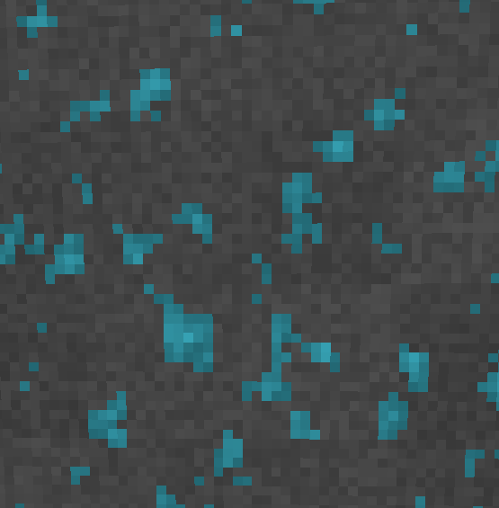

# Minecraft-Raytracing
This is my attempt at making a minecraft clone using exclusively voxel raytracing and procedural textures.  
I'm using one primary ray for the base block color, and two reflection and refraction rays for the visual effects.  
The map generation is done procedurally in a compute shader, to allow very fast generation of vast worlds.  
The textures are also procedural, computed in the fragment shader, so each block can have a different appearance, and be at a virtually infinite resolution.  

The game currently doesn't support any acceleration structure, and the whole world is stored in one big OpenGL 2D texture, so it isn't infinite. I also know the procedural textures takes quite the GPU load, but it was just a fun experiment to see how far I could go with fully procedural worlds running on the GPU.

## Images
  
*Procedural terrain generation on the GPU*  
 
 
 
  
*Showcasing rivers*  
 
 
 
  
*Animated water with reflections*  
 
 
 
    
*I also implemented sub-voxels of arbitrary size, that we can load from magicavoxel*  
 
 
 
    
*Another detailled log*  
 
 
 
    
*Procedural sky using noise to fake clouds*  
 
 
 
    
*Showcasing procedural bricks*  
 
 
 
    
*and ores*  
 
 
 

